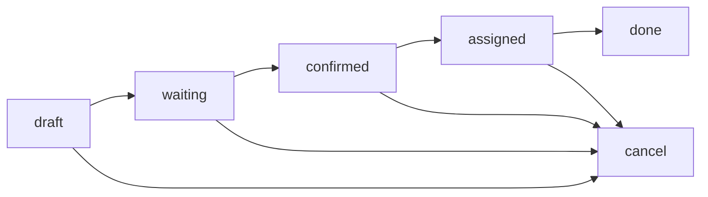

# Documentation - Gestion des Inventaires (Stock.Picking)

## Vue d'ensemble

Cette section ajoute la gestion complète des inventaires au système POS en utilisant le modèle Odoo `stock.picking`. Les endpoints permettent de :

- ✅ **Lister les transferts de stock** pour un point de vente
- ✅ **Changer l'état des transferts** (de prêt à fait, etc.)
- ✅ **Filtrer par état, date, partenaire**
- ✅ **Gérer le workflow complet** des inventaires

## Modèle Stock.Picking

Le modèle `stock.picking` représente les **transferts de stock** dans Odoo :
- 📦 **Réceptions** fournisseurs (incoming)
- 📤 **Livraisons** clients (outgoing)  
- 🔄 **Transferts internes** (internal)
- 📋 **Inventaires** et ajustements

### États du Workflow

Les transferts peuvent avoir les états suivants :
- `draft` : Brouillon
- `waiting` : En attente d'une autre opération
- `confirmed` : Confirmé (en attente de disponibilité des produits)  
- `assigned` : Prêt (produits réservés et disponibles)
- `done` : Terminé/Fait
- `cancel` : Annulé

**Note importante** : L'état `assigned` correspond à "Prêt" dans Odoo.



- **`draft`** : Brouillon, non confirmé
- **`waiting`** : En attente d'une autre opération
- **`ready`** : Prêt à être traité ⭐
- **`done`** : Terminé/traité ⭐
- **`cancel`** : Annulé

## Endpoints Disponibles

### 1. Liste des Transferts de Stock
**GET** `/pos/{pos_id}/inventory/transfers`

Récupère tous les transferts de stock liés à un point de vente.

**Paramètres de requête :**
```http
GET /pos/1/inventory/transfers?state=ready&limit=10&date_from=2024-01-01
```

**Filtres disponibles :**
- `state` : État du transfert (draft/waiting/ready/done/cancel)
- `picking_type_code` : Type d'opération (incoming/outgoing/internal)
- `date_from` : Date de début (YYYY-MM-DD)
- `date_to` : Date de fin (YYYY-MM-DD)
- `partner_id` : ID du partenaire/fournisseur
- `limit` : Nombre max de résultats (défaut: 50, max: 500)

**Réponse :**
```json
{
  "success": true,
  "data": {
    "pos_info": {
      "id": 1,
      "name": "PDV Principal",
      "warehouse_id": [1, "Entrepôt Principal"]
    },
    "transfers": [
      {
        "id": 123,
        "name": "WH/IN/00001",
        "origin": "PO00001",
        "state": "ready",
        "picking_type_code": "incoming",
        "partner_id": [10, "Fournisseur ABC"],
        "location_id": [8, "Fournisseurs"],
        "location_dest_id": [12, "Stock"],
        "scheduled_date": "2024-01-15 10:00:00",
        "date_done": null,
        "user_id": [2, "Admin"],
        "products_availability": "Available",
        "move_ids": [45, 46, 47],
        "note": "Livraison urgente"
      }
    ],
    "filters_applied": {
      "state": "ready",
      "date_from": "2024-01-01"
    }
  },
  "count": 1,
  "message": "Trouvé 1 transfert(s) pour le PDV 'PDV Principal'"
}
```

---

### 2. Changer l'État des Transferts
**POST** `/pos/{pos_id}/inventory/transfers/update-state`

Fait évoluer l'état des transferts selon le workflow Odoo.

**Actions disponibles :**
- **`confirm`** : Confirmer (draft → waiting/ready)
- **`assign`** : Réserver les produits (waiting → ready) 
- **`done`** : Valider et terminer (ready → done) ⭐
- **`cancel`** : Annuler le transfert

**Paramètres :**
```json
{
  "picking_ids": [123, 124, 125],
  "action": "done",
  "force": false
}
```

- `picking_ids` : Liste des IDs de transferts à traiter
- `action` : Action à effectuer (confirm/assign/done/cancel)
- `force` : Forcer l'action même si les conditions ne sont pas remplies

**Réponse :**
```json
{
  "success": true,
  "data": {
    "pos_info": {
      "id": 1,
      "name": "PDV Principal"
    },
    "action": "done",
    "results": [
      {
        "id": 123,
        "name": "WH/IN/00001",
        "previous_state": "ready",
        "new_state": "done",
        "success": true
      },
      {
        "id": 124,
        "name": "WH/IN/00002", 
        "previous_state": "draft",
        "new_state": "draft",
        "success": false,
        "error": "État 'draft' ne permet pas la validation"
      }
    ],
    "summary": {
      "total_processed": 2,
      "success_count": 1,
      "error_count": 1
    },
    "errors": [
      "WH/IN/00002: État 'draft' ne permet pas la validation"
    ]
  },
  "message": "Action 'done' : 1 succès, 1 erreur(s)"
}
```

## Workflows Typiques

### 1. Réception Fournisseur
```bash
# 1. Lister les réceptions en attente
GET /pos/1/inventory/transfers?picking_type_code=incoming&state=ready

# 2. Valider la réception (prêt → fait)
POST /pos/1/inventory/transfers/update-state
{
  "picking_ids": [123],
  "action": "done"
}
```

### 2. Livraison Client
```bash
# 1. Trouver les livraisons prêtes
GET /pos/1/inventory/transfers?picking_type_code=outgoing&state=ready

# 2. Marquer comme terminé
POST /pos/1/inventory/transfers/update-state
{
  "picking_ids": [456],
  "action": "done"
}
```

### 3. Transfert Interne
```bash
# 1. Lister les transferts internes
GET /pos/1/inventory/transfers?picking_type_code=internal

# 2. Confirmer puis valider
POST /pos/1/inventory/transfers/update-state
{
  "picking_ids": [789],
  "action": "confirm"
}

POST /pos/1/inventory/transfers/update-state
{
  "picking_ids": [789], 
  "action": "done"
}
```

## Types d'Opérations

### 📥 Incoming (Réceptions)
- **But** : Réceptionner des marchandises
- **Flux** : Fournisseur → Stock
- **États courants** : draft → ready → done

### 📤 Outgoing (Livraisons)
- **But** : Livrer aux clients
- **Flux** : Stock → Client
- **États courants** : ready → done

### 🔄 Internal (Transferts Internes)
- **But** : Déplacer entre emplacements
- **Flux** : Emplacement A → Emplacement B
- **États courants** : draft → ready → done

## Filtrage Avancé

### Par État
```bash
# Transferts prêts à traiter
GET /pos/1/inventory/transfers?state=ready

# Transferts terminés aujourd'hui
GET /pos/1/inventory/transfers?state=done&date_from=2024-01-15&date_to=2024-01-15
```

### Par Type d'Opération
```bash
# Réceptions uniquement
GET /pos/1/inventory/transfers?picking_type_code=incoming

# Livraisons uniquement  
GET /pos/1/inventory/transfers?picking_type_code=outgoing
```

### Par Période
```bash
# Transferts du mois
GET /pos/1/inventory/transfers?date_from=2024-01-01&date_to=2024-01-31

# Transferts récents
GET /pos/1/inventory/transfers?date_from=2024-01-10&limit=20
```

### Par Partenaire
```bash
# Transferts avec un fournisseur spécifique
GET /pos/1/inventory/transfers?partner_id=123&picking_type_code=incoming
```

## Gestion des Erreurs

### Codes d'Erreur
| Code | Description |
|------|-------------|
| 400 | Données invalides ou état incompatible |
| 404 | PDV ou transferts non trouvés |
| 401 | Non authentifié |
| 403 | Permissions insuffisantes |
| 500 | Erreur serveur ou Odoo |

### Erreurs Courantes
```json
{
  "success": false,
  "data": {
    "errors": [
      "WH/IN/00001: État 'done' ne permet pas la modification",
      "WH/OUT/00002: Quantités insuffisantes en stock"
    ]
  }
}
```

## Sécurité et Permissions

### Authentification Requise
- ✅ Token JWT valide
- ✅ Scope `pos` dans le token
- ✅ Utilisateur actif dans Odoo

### Contrôles d'Accès
- 🔒 **PDV assigné** : L'utilisateur doit avoir accès au PDV
- 🔒 **Entrepôt** : Transferts filtrés par entrepôt du PDV
- 🔒 **Société** : Respect de la multi-société

## Intégration avec Odoo

### Modules Requis
- **`stock`** : Gestion de stock de base
- **`point_of_sale`** : Liaison avec les PDV (optionnel)

### Modèles Liés
- **`stock.picking`** : Transfert principal
- **`stock.move`** : Mouvements de produits
- **`stock.location`** : Emplacements
- **`res.partner`** : Partenaires/fournisseurs

### Actions Odoo Utilisées
- `action_confirm()` : Confirmer le transfert
- `action_assign()` : Réserver les quantités
- `button_validate()` : Valider (méthode recommandée)
- `action_done()` : Forcer la validation
- `action_cancel()` : Annuler

## Cas d'Usage

### Station-Service
```bash
# Réception de carburant
GET /pos/1/inventory/transfers?picking_type_code=incoming&state=ready
POST /pos/1/inventory/transfers/update-state {"picking_ids": [123], "action": "done"}

# Transfert vers pompes
GET /pos/1/inventory/transfers?picking_type_code=internal&state=ready
```

### Commerce de Détail
```bash
# Livraisons fournisseurs
GET /pos/1/inventory/transfers?picking_type_code=incoming&date_from=2024-01-01

# Ventes (sorties de stock)
GET /pos/1/inventory/transfers?picking_type_code=outgoing&state=ready
```

### Entrepôt
```bash
# Transferts internes quotidiens
GET /pos/1/inventory/transfers?picking_type_code=internal&date_from=2024-01-15

# Validation en lot
POST /pos/1/inventory/transfers/update-state {
  "picking_ids": [100, 101, 102],
  "action": "done"
}
```

## Monitoring et Logs

### Logs Automatiques
- 📝 **Actions utilisateur** : Qui a validé quoi
- 📊 **Performances** : Temps de traitement
- ⚠️ **Erreurs** : Échecs de validation

### Métriques Disponibles
- 📈 **Transferts par état** : Répartition des statuts
- 📊 **Transferts par type** : Incoming vs Outgoing
- ⏱️ **Temps moyen** : De création à validation

## Test et Validation

Script de test fourni :
```bash
python test_inventory_management.py
```

**Tests automatiques :**
1. ✅ Liste des transferts sans filtre
2. ✅ Filtrage par état, date, type
3. ✅ Changement d'état (confirm/done/cancel)
4. ✅ Gestion des erreurs
5. ✅ Permissions et sécurité

Cette implémentation fournit une gestion complète des inventaires via l'API, parfaitement intégrée avec le workflow Odoo standard.
