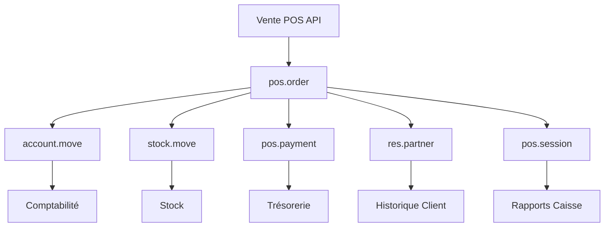

# Traçabilité des Ventes POS dans Odoo

## Vue d'ensemble

Quand vous utilisez l'endpoint `/pos/{pos_id}/create-order` pour créer une vente, **OUI, vous avez une traçabilité complète** dans le module de vente et les autres modules Odoo. Voici comment cela fonctionne :

## 🔄 Flux de Traçabilité Complet

### 1. Création de la Commande POS
```bash
POST /pos/{pos_id}/create-order
```

**Ce qui se passe dans Odoo :**
- ✅ Création d'un enregistrement `pos.order`
- ✅ Référence unique (`pos_reference`)
- ✅ Liaison avec la session POS (`session_id`)
- ✅ Association à l'utilisateur (`user_id`)
- ✅ Lien vers le client si fourni (`partner_id`)

### 2. Intégration Comptable Automatique

**Écritures comptables générées :**
- 📚 **account.move** : Écriture comptable principale
- 💰 **account.move.line** : Lignes de débit/crédit
- 🏦 **Journaux comptables** : Selon la configuration POS

**Exemple d'écriture :**
```
Débit  : Compte Caisse POS        100,00 €
Crédit : Compte Ventes            100,00 €
```

### 3. Gestion de Stock Automatique

**Mouvements de stock créés :**
- 📦 **stock.move** : Mouvement de sortie pour chaque produit
- 📍 **Emplacements** : Depuis stock vers client
- 🔢 **Quantités** : Mise à jour automatique des stocks

**Traçabilité stock :**
```
Produit: Essence SP95
Emplacement: Stock PDV → Client
Quantité: -50L
Origine: POS/Order-123
```

### 4. Historique Client

**Si un client est associé :**
- 👤 **res.partner** : Historique des achats
- 📊 **Rapports de vente** : Analyse par client
- 🎯 **Fidélisation** : Points, remises, etc.

## 📊 Modules Odoo Impactés

### Module Point de Vente (point_of_sale)
- **pos.order** : Commande principale
- **pos.order.line** : Lignes de produits
- **pos.payment** : Paiements
- **pos.session** : Session de caisse

### Module Comptabilité (account)
- **account.move** : Écritures comptables
- **account.move.line** : Lignes comptables
- **account.journal** : Journaux POS

### Module Stock (stock)
- **stock.move** : Mouvements de produits
- **stock.quant** : Quantités en stock
- **stock.location** : Emplacements

### Module Ventes (sale) - Optionnel
Si le module POS n'est pas installé, l'API crée automatiquement :
- **sale.order** : Commande de vente standard
- **sale.order.line** : Lignes de vente

## 🔍 Traçabilité Disponible

### 1. Par Numéro de Commande
```sql
-- Rechercher une commande POS
SELECT * FROM pos_order WHERE pos_reference = 'Order-1-1697545123';

-- Voir l'écriture comptable associée
SELECT am.* FROM account_move am 
JOIN pos_order po ON po.account_move = am.id 
WHERE po.pos_reference = 'Order-1-1697545123';
```

### 2. Par Session POS
```sql
-- Toutes les commandes d'une session
SELECT * FROM pos_order WHERE session_id = 42;

-- Chiffre d'affaires de la session
SELECT SUM(amount_total) FROM pos_order WHERE session_id = 42;
```

### 3. Par Produit
```sql
-- Ventes d'un produit
SELECT pol.*, po.date_order, po.pos_reference 
FROM pos_order_line pol
JOIN pos_order po ON pol.order_id = po.id
WHERE pol.product_id = 123;
```

### 4. Par Client
```sql
-- Historique d'achat d'un client
SELECT * FROM pos_order 
WHERE partner_id = 456 
ORDER BY date_order DESC;
```

## 📈 Rapports et Analyses

### Rapports Standard Odoo
- 📊 **Analyse des ventes POS**
- 💰 **Rapport de session**
- 📦 **Mouvement de stock**
- 👥 **Ventes par client**

### Via API - Endpoints de consultation
```bash
# Historique des commandes
GET /odoo/search
{
  "model": "pos.order",
  "domain": [["date_order", ">=", "2024-01-01"]],
  "fields": ["pos_reference", "amount_total", "partner_id"]
}

# Mouvements de stock liés
GET /odoo/search
{
  "model": "stock.move",
  "domain": [["origin", "ilike", "POS"]],
  "fields": ["product_id", "product_uom_qty", "date"]
}
```

## 🏗️ Architecture de Traçabilité



## 🔐 Sécurité et Contrôles

### Contrôles Automatiques
- ✅ **Cohérence stock** : Vérification des quantités
- ✅ **Équilibrage comptable** : Débit = Crédit
- ✅ **Validation session** : Session ouverte requise
- ✅ **Droits utilisateur** : Permissions POS

### Audit Trail
- 📝 **Traçabilité complète** : Qui, quoi, quand
- 🔒 **Immutabilité** : Commandes validées non modifiables
- 📊 **Logs système** : Enregistrement des actions

## 💡 Avantages de cette Traçabilité

### Pour la Gestion
- 📊 **Reporting complet** : Ventes, stocks, trésorerie
- 🎯 **Analyse performance** : Par produit, utilisateur, période
- 💰 **Contrôle financier** : Écritures comptables automatiques

### Pour la Conformité
- 📋 **Audit** : Piste de vérification complète
- 🧾 **Factures** : Génération automatique possible
- 📈 **TVA** : Calculs et déclarations automatiques

### Pour le Business
- 👥 **CRM** : Historique client intégré
- 📦 **Inventory** : Stock temps réel
- 🔄 **Workflow** : Processus automatisés

## 🚀 Exemple Complet

### Vente réalisée :
```json
POST /pos/1/create-order
{
  "pos_session_id": 42,
  "partner_id": 123,
  "lines": [
    {
      "product_id": 456,
      "qty": 2,
      "price_unit": 50.00
    }
  ],
  "payment_method_id": 1,
  "amount_paid": 100.00
}
```

### Résultat dans Odoo :

**pos.order :**
- ID: 789
- Reference: "Order-1-1697545123"
- Client: "Jean Dupont"
- Total: 100,00 €

**account.move :**
- Journal: "Point de Vente"
- Débit Caisse: 100,00 €
- Crédit Ventes: 100,00 €

**stock.move :**
- Produit: "Produit Test"
- Quantité: -2
- Origine: "Order-1-1697545123"

## ✅ Conclusion

**OUI, la traçabilité est complète !** Chaque vente créée via l'API :

1. ✅ **Génère une pos.order** dans Odoo
2. ✅ **Crée les écritures comptables** automatiquement
3. ✅ **Met à jour les stocks** en temps réel
4. ✅ **Enregistre l'historique client** si applicable
5. ✅ **Permet la génération de rapports** complets
6. ✅ **Respecte les règles comptables** et fiscales
7. ✅ **Fournit une piste d'audit** complète

La traçabilité est donc **identique à une vente faite directement dans l'interface Odoo POS**, avec tous les avantages d'intégration des modules Odoo.
